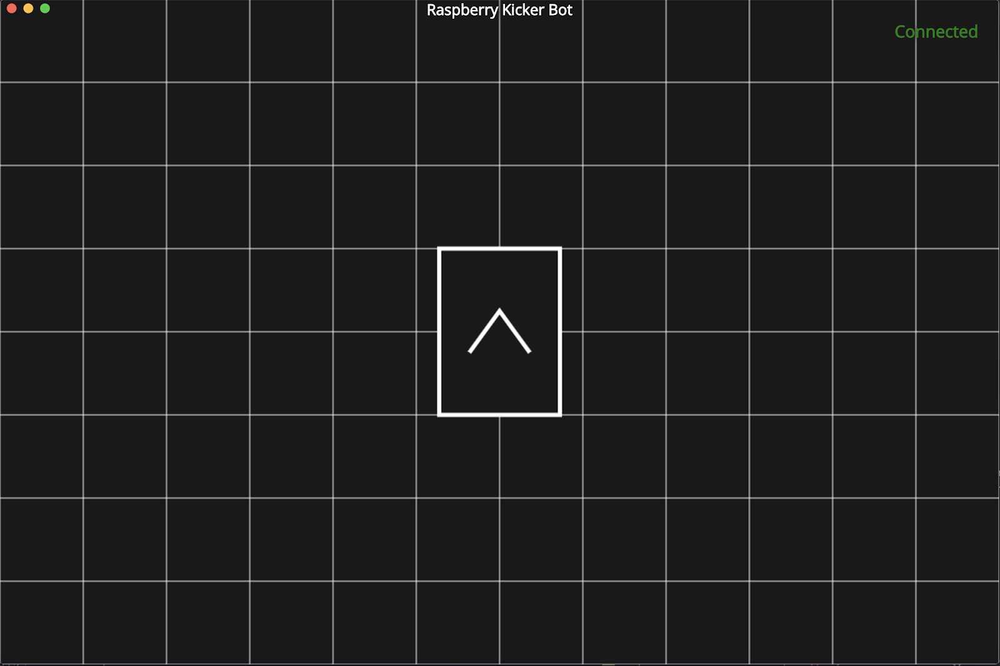
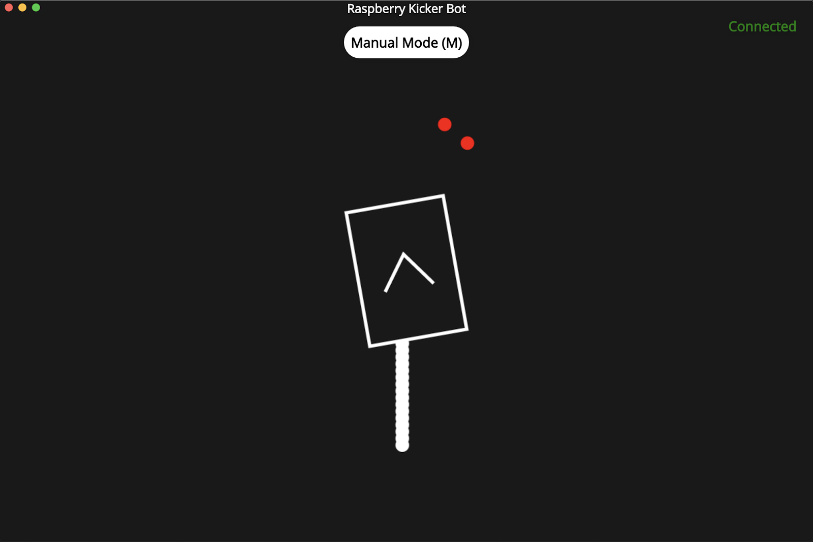
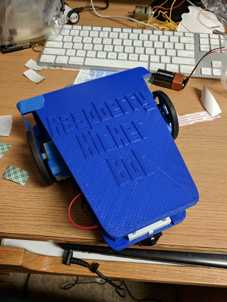

# Raspberry Kicker Bot (2018 project)

Autonomous path planning testing platform using a Raspberry Pi. Programmed with the aid of raspberry kickers (redbull).

# Goal

Create a dynamic IOT path planning testing application that can control a Raspberry Pi robot using a simple REST communication layer.

# User Interface

- Designed to visualize the path the robot takes by tracking commands sent to determine localization. Uses PING Ultrasonic sensor to determine distance to objects and plots along path.

- Allows manual mode to control robot using AWSD or an XBox controller

# Building the Robot

The chassis for the robot was designed using OpenSCAD and 3D printed on a Creality Ender 3 printer. Uses GPIO pins from rPi and 2 L293D motor controllers to allow forward/backward driving of 2 DC gearbox motors mounted on the sides.
